# Инструкция по установке Docker

Первое, что нужно сделать - это зарегистрироваться (получить Docker ID) на [Docker Hub](https://hub.docker.com/).

Выбираете `Sign Up`:

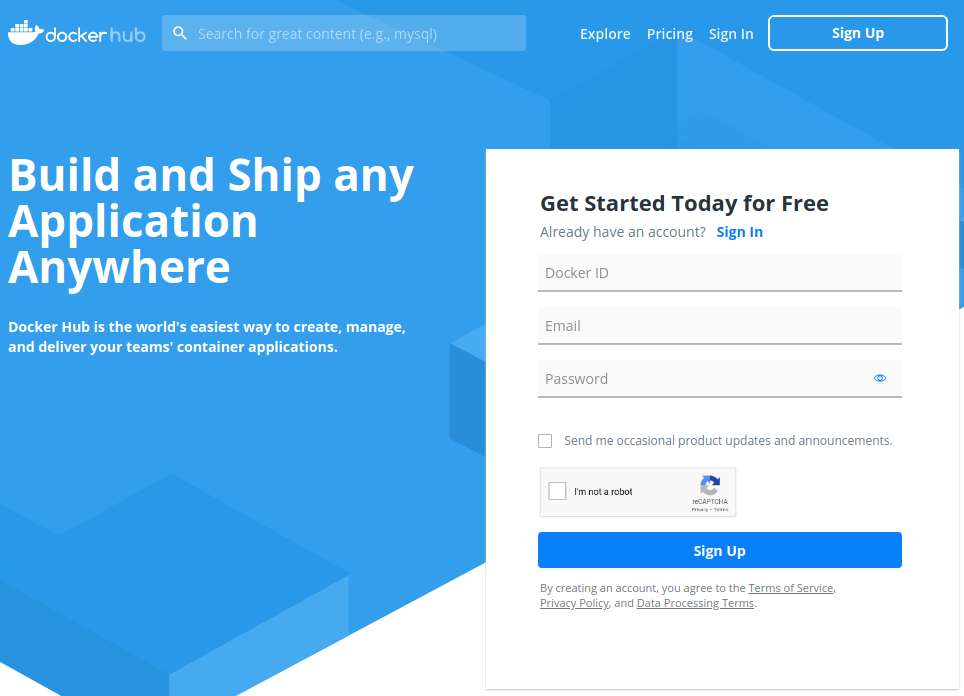

Заполняете форму, регистрируйтесь.

Второе, что нужно сделать - это определиться с вашей ОС и версией:
* Пользователи Windows 7, Windows 10 (ниже PRO) - вам нужен Docker Toolbox. Установка описана [здесь](https://docs.docker.com/toolbox/toolbox_install_windows/)
* Пользователи Windows 10 PRO - вам нужен Docker Desktop. Установка описана [здесь](https://docs.docker.com/docker-for-windows/install/).
* Пользователи MacOS (год выпуска 2010+ и ОС 10.13 и выше) - вам нужен Docker Desktop. Установка описана [здесь](https://docs.docker.com/docker-for-mac/install/)
* Пользователи более старых маков - вам нужен Docker Toolbox. Установка описана [здесь](https://docs.docker.com/toolbox/toolbox_install_mac/)
* Пользователи Linux, в зависимости от дистрибутива: [Ubuntu](https://docs.docker.com/install/linux/docker-ce/ubuntu/), [Debian](https://docs.docker.com/install/linux/docker-ce/debian/). Не забудьте так же про [Post Installation](https://docs.docker.com/install/linux/linux-postinstall/)

**Важно**: замечание для пользователей Docker Toolbox на Windows - вам вместо localhost придётся писать `192.168.99.100`. 

Если работать не будет, то выполните в консоли команду `docker-machine ip default` и увидите адрес (его нужно будет использовать во всех примерах вместо `localhost`).

**Q**: Что делать, если ничего не получилось?

**A**: Ничего страшного, будете пользоваться [облачной версией](https://labs.play-with-docker.com/) - нужна учётка Docker ID. Этот сервис предоставляет 4х часовые сессии для запуска контейнеров и позволяет открывать порты

## Работа с Play With Docker (далее - Playground)

Логинитесь, получаете сессию в несколько часов:

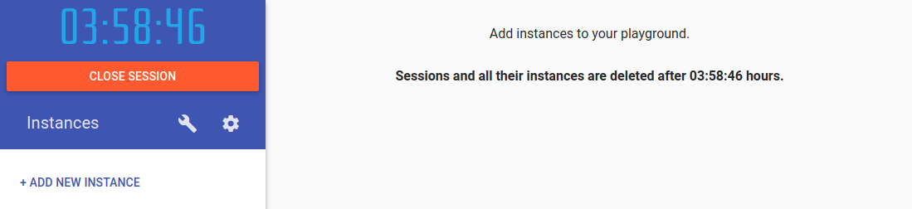

Нажимаете `ADD NEW INSTANCE`, чтобы получить консоль:

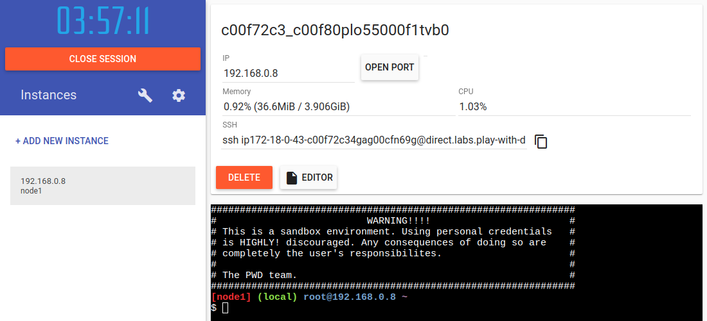

### Как закинуть туда файлы

#### Вариант 1: нужно скачать файлы из сети Интернет

В Playground есть `wget`, позволяющий скачивать файлы:

`wget <url>`

Например, нужно скачать словарь паролей с GitHub.

1\. Переходите [по ссылке](https://github.com/danielmiessler/SecLists/tree/master/Passwords/Common-Credentials): 

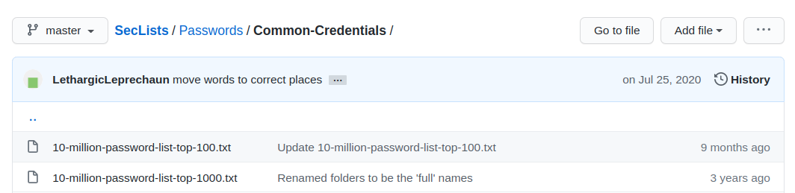

2\. Кликаете на нужном файле:

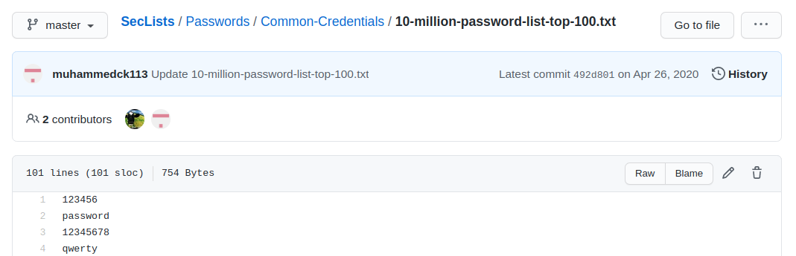

3\. Нажимаете на кнопку `Raw`, чтобы получить прямо адрес (скопируйте его):

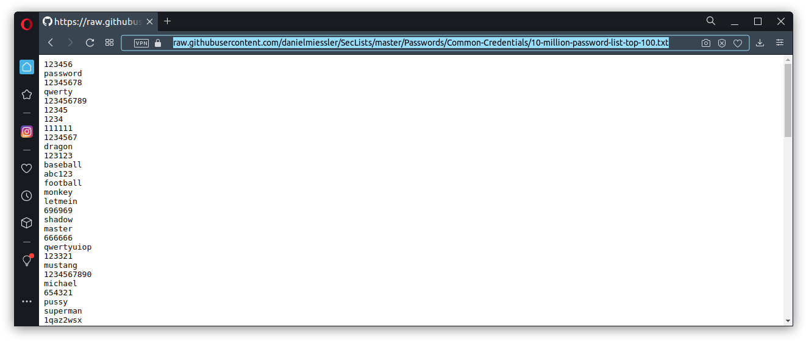

4\. Подставляете скопированную ссылку (`Shift + Insert`):

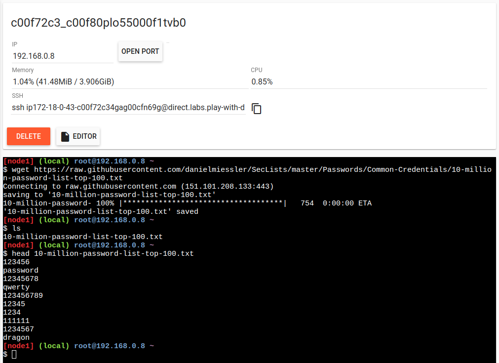

Далее используете материал лекций по Linux для работы.

#### Вариант 2: нужно закинуть файлы с компьютера

1\. Копируете строку для ssh подключения:

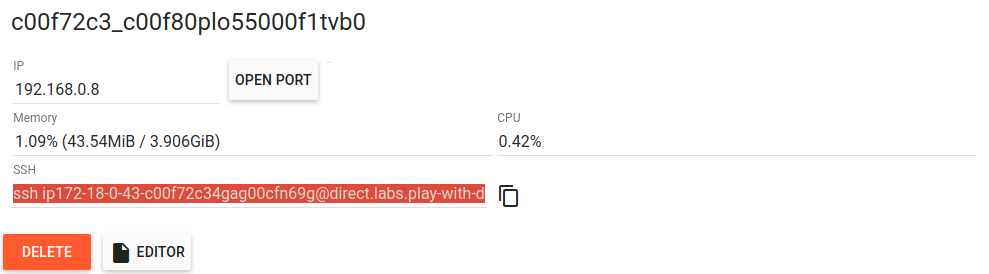

2\. Используя программу (на ваше усмотрение) `mc`, `scp` (если у вас Windows - есть Cygwin, если Mac - Homebrew) копируете файлы с вашего компьютера на сервер:

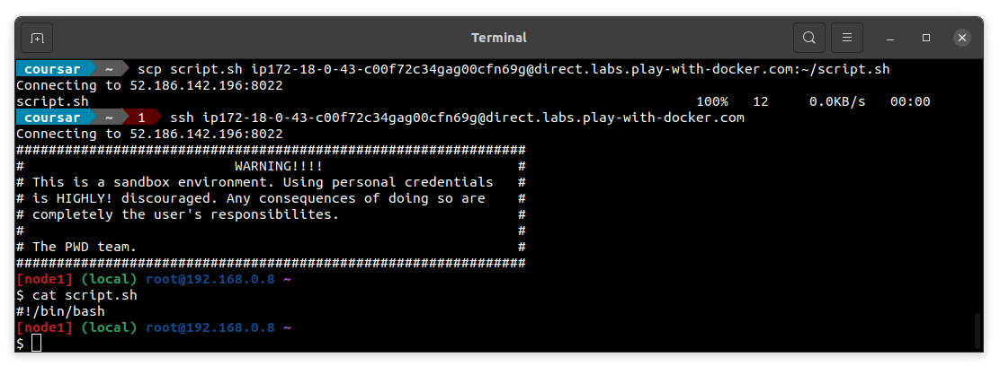

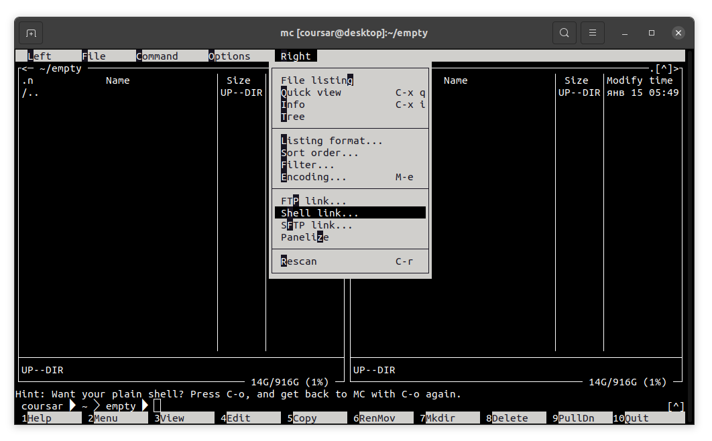

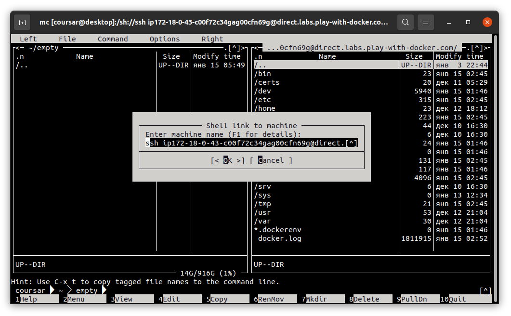

<details>
<summary>Для пользователей Windows</summary>

В Cygwin вам необходимо будет установить следующие пакеты:
* openssh
* mc

После установки запустить `ssh-keygen` и нажать Enter (оставляйте значения по умолчанию).

После этого вы можете использовать команды подключения аналогичными представленным на скриншоте.
</details>


### Как забрать файлы оттуда

С помощью `mc`, `scp` со своего компьютера.

В случае `scp` нужно будет сначала писать путь на сервере, а затем локальный:

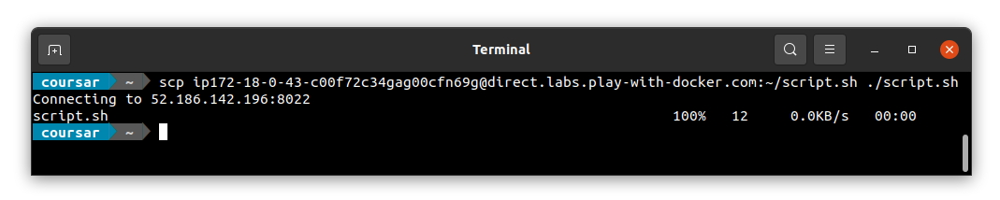

### Как редактировать файлы

Редактировать файлы вы можете как прямо в терминале (но тогда вам нужно использовать `mcedit`, `nano` или `vim`), либо с помощью кнопки EDITOR:

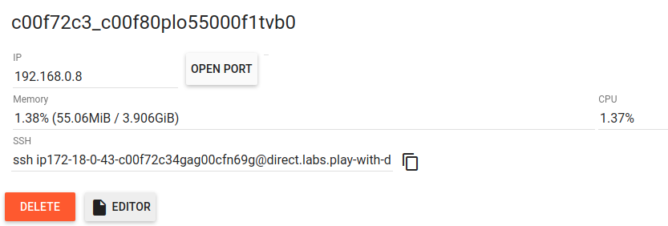

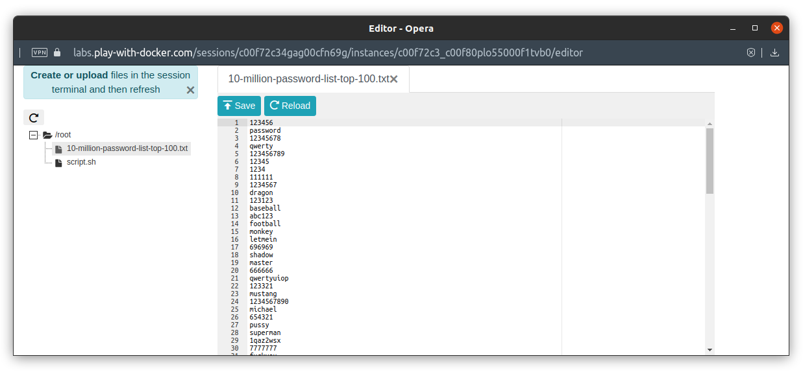

Примечание*: не забывайте нажать на кнопку `Save`.

### Установка приложений

Необходимые приложения вы можете установить через пакетный менеджер apk:
```
apk add mc

mc -b
```

### tmux

Для более комфортной работы используйте ssh, либо консольный менеджер tmux, который позволяет вам в одной консоли эмулировать несколько:
```
tmux
```

[Документация по tmux](http://xgu.ru/wiki/tmux)

Вам нужно только вот эти горячие клавиши:
* Создание нового окна: `ctrl + b + c`
* Переход на следующее окно (текущее выделено *): `ctrl + b + n`
* Закрытие текущего окна: `ctrl + b + x`
