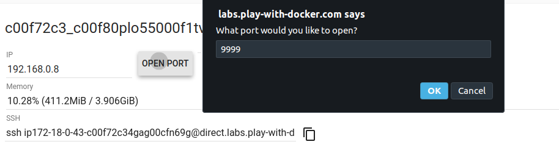
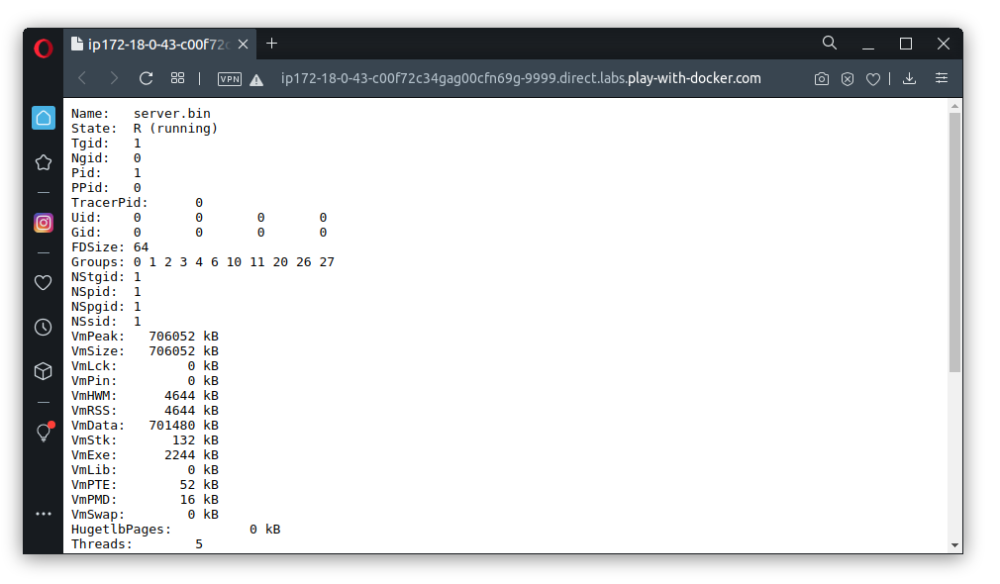

# Multistage building

Multistage build подразумевает, что разработчики могут использовать результаты работы, например, файлы, полученные при работе в построенном из одного образа контейнере, для построения другого образа.

Пример: когда вы программировали на Go, вам нужно было установить Go, скомпилировать приложение, а потом запустить.

Почему бы не попробовать сделать это с помощью Docker?

В результате вы:
- создадите образ на базе образа, в котором установлен Go;
- соберёте ваше приложение;
- используете результаты сборки для построения финального образа.

В вашем случае это будет выглядеть так:
1. Берёте образ, в котором установлена нужная версия Go.
2. Создаёте на базе него свой образ, в который копируете ваши файлы, а именно сервер.
3. Запускаете из образа контейнер, в котором и производите сборку. На самом деле это сделает сам Docker.
4. Результаты сборки копируете в новый образ.

```dockerfile
FROM golang:1.15-alpine AS build
COPY main.go /app/
ENV CGO_ENABLED=0
WORKDIR /app
RUN go build -o server.bin main.go
RUN chmod +x server.bin

FROM alpine
COPY --from=build /app/server.bin /app/
CMD ["/app/server.bin"]
```

<details>
<summary>Содержимое файла main.go</summary>.

Достаточно скопировать и сохранить под именем `main.go`:
```go
package main

import (
	"io/ioutil"
	"log"
	"net/http"
	"os"
)

type Handler struct { }

func (h Handler) ServeHTTP(writer http.ResponseWriter, request *http.Request)  {
	data, err := ioutil.ReadFile("/proc/1/status")
	if err != nil {
		log.Print(err)
		writer.Header().Set("Content-Type", "text/plain")
		writer.Write([]byte("error occurred"))
		return
	}

	writer.Header().Set("Content-Type", "text/plain")
	writer.Write(data)
}

func main() {
	h := Handler{}
	s := http.Server{
		Addr:    "0.0.0.0:9999",
		Handler: h,
	}
	err := s.ListenAndServe()
	if err != nil {
		log.Print(err)
		os.Exit(1)
	}
}
```
</details>

Рассмотрим моменты, которые ещё не рассматривали.
* `AS build` — даёте имя образу, собираемому на этом этапе, чтобы использовать его на следующих этапах сборки.
* `ADD . /app` — добавляете всё содержимое, а так как сам файл будет в корне репо, то все файлы, текущего каталога `.` в каталог `/app` в образе.
* `ENV` — устанавливаете значение переменной окружения.
* `WORKDIR` — устанавливаете рабочий каталог для следующих команд.
* `RUN` — запускаете сборку.
* `COPY --from=build` — копируете файл из образа, созданного на одной из предыдущих стадий.

Образы:
1. [golang:1-15-alpine](https://hub.docker.com/_/golang) — образ с дистрибутивом Alpine Linux и установленным Go версии 1.15.
2. [alpine:3.7](https://hub.docker.com/_/golang) — образ с дистрибутивом Alpine Linux последней версии.

[Alpine Linux](https://alpinelinux.org) — это минималистичный образ весом около 5 Мб, который  любят использовать разработчики в качестве базового. Для сравнения: образ Ubuntu весит 72 Мб, и это ещё очень мало. Некоторые образы достигают нескольких сотен мегабайт вплоть до гигабайта.

Теперь попробуйте это собрать:
```shell script
docker build -t ibdevserver .
docker container run -p 9999:9999 ibdevserver
```

После этого можете открыть в браузере `localhost` на порту 9999 или `docker-machine ip default`, если у вас Docker Toolbox.

Для тех, кто использует Play With Docker, нужно открыть порт с помощью кнопки `OPEN PORT`. Браузер сам откроет новую вкладку.





На лекции мы говорили, что каждый раз набирать команды руками неудобно, поэтому мы можем «упаковать» эти инструкции в `docker-compose.yml`:

```yml
version: '3.7'
services:
  server:
    build: .
    image: ibdevserver
    ports:
      - 9999:9999
```

И запускать всё одной командой: `docker-compose up --build`. Убедитесь, что до этого вы остановили запущенный контейнер.

Детальная информация о файле Docker Compose есть в [официальной документации](https://github.com/compose-spec/compose-spec/blob/master/spec.md).

Все файлы из этого документеа расположены в каталоге [assets](assets).
