# Домашнее задание к занятию «1.2. Популярные языки, системы сборки, управления зависимостями»

В качестве результата пришлите ответы на вопросы в личном кабинете студента на сайте [netology.ru](https://netology.ru).

## Предисловие

Данные ДЗ будут представлять собой лабораторные работы, в рамках которой вы по инструкциям выполните определённые шаги.

## Задание SonarQube

На лекции мы с вами говорили, что исходный код приложения является источником потенциальных уязвимостей.

Конечно же, исходный код приложения можно проверить и "глазами", но при современных объёмах кода - это достаточно трудоёмкая задача.

Поэтому существуют специальные инструменты, которые позволяют анализировать качество кода (в том числе пытаются найти в нём уязвимости)

С одним из подобных инструментов ([SonarQube](https://www.sonarqube.org/)) мы познакомимся в рамках данного ДЗ (альтернативы рассмотрим на одной из следующих лекций).

**Важно**: вам не нужно учить Java и детально разбираться в коде. Ваши задачи:
1. Получить базовый опыт работы с инструментом
1. Проанализировать предупреждения, баги и уязвимости

### Описание проекта

Мы подготовили для вас специальным образом написанный учебный проект, написанный на языке Java и использующий систему сборки Maven.

Проект представляет собой веб-сервер, работающий на порту 8080, и отвечающий HTTP-запросы.

Страница http://localhost:8080/users.html закрыта логином и паролем admin/secret.

Чтобы собрать образ и запустить его (это не обязательно для выполнения ДЗ), вам нужно:
1. Скачать [app.tgz](assets/app.tgz)
1. Скачать [Dockerfile](assets/Dockerfile)
1. Скачать [docker-compose.yml](assets/docker-compose.yml)
1. В каталоге со скачанными файлами выполнить: `docker-compose up --build ibdev`

### Порядок выполнения

**Важно**: если вы планируете работать в Play With Docker, то используйте `tmux` или подключение по ssh для открытия нескольких терминалов (либо, если вы хорошо владеете консолью, переводите foreground процессы в background и обратно по мере необходимости).

0\. Скопируйте на целевую машину файл [docker-compose.yml](assets/docker-compose.yml) и откройте терминал в том же каталоге

1\. Запустите сервис SonarQube:

```shell
docker-composer up sonarqube
```

Эта команда позволяет запустить только данный сервис и те, от которых он зависит (а не все, перечисленные в `docker-compose.yml`)

2\. Дождитесь появления в логах записи `SonarQube is up`, после чего зайдите на http://localhost:9000 (либо `docker-machine ip` и порт 9000, либо на 9000 порту в Play With Docker).

3\. Для входа используйте следующие учётные данные:
* логин - `admin`
* пароль - `admin`

4\. На главной странице нажмите кнопку `Create new project`:

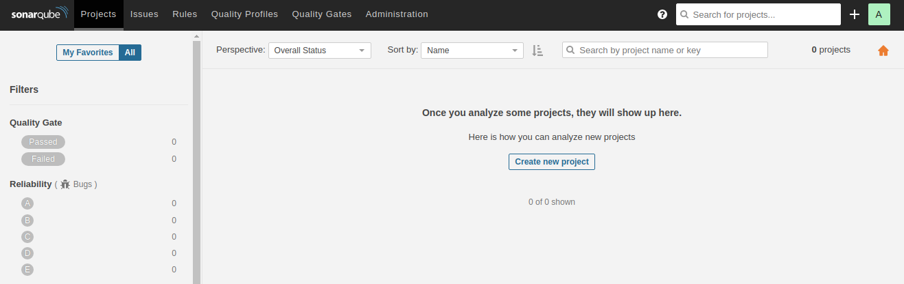

5\. Введите ключ проекта (это нечто вроде кода проекта) и нажмите кнопку `Setup`:

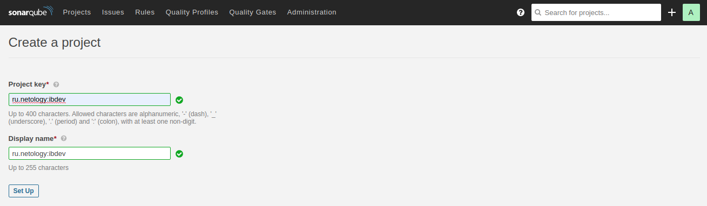

6\. Введите имя токена (ключа доступа) и нажмите на кнопку `Generate`:

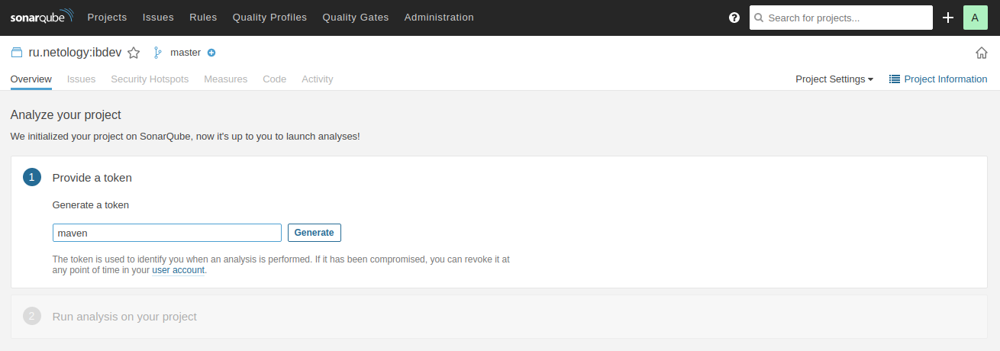

7\. После генерации токена нажмите на кнопку `Continue`:

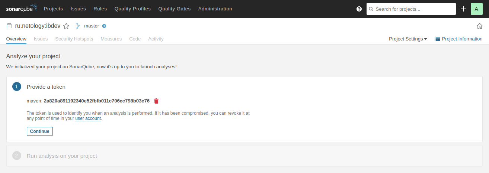

8\. Выберите опцию `Maven` и скопируйте сгенерированный код:

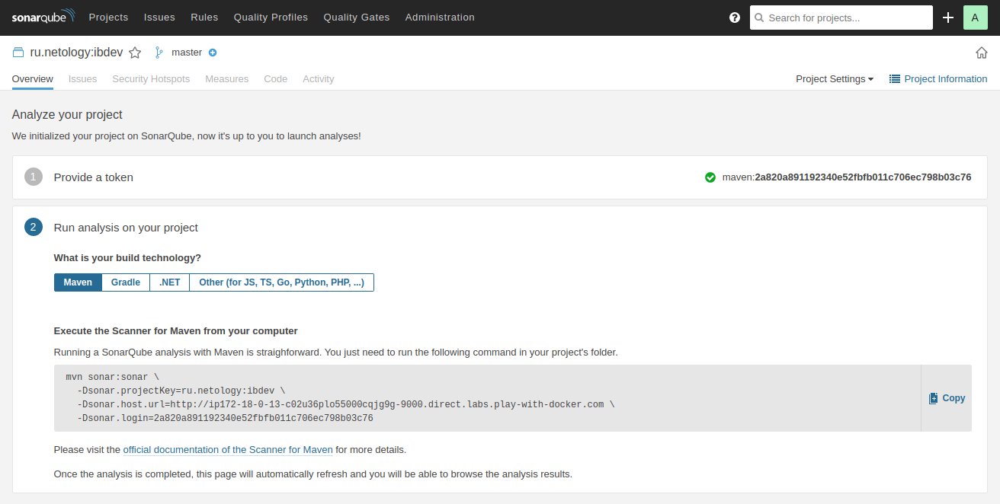

Необходимо скопировать вот этот код:
```
mvn sonar:sonar \
  -Dsonar.projectKey=ru.netology:ibdev \
  -Dsonar.host.url=http://ip172-18-0-13-c02u36plo55000cqjg9g-9000.direct.labs.play-with-docker.com \
  -Dsonar.login=2a820a891192340e52fbfb011c706ec798b03c76
```

И заменить в нём строку: `-Dsonar.host.url=http://ip172-18-0-13-c02u36plo55000cqjg9g-9000.direct.labs.play-with-docker.com \` на `-Dsonar.host.url=http://sonarqube:9000 \`.

Т.е. должно получиться:
```
mvn sonar:sonar \
  -Dsonar.projectKey=ru.netology:ibdev \
  -Dsonar.host.url=http://sonarqube:9000 \
  -Dsonar.login=2a820a891192340e52fbfb011c706ec798b03c76
```

Это сделано потому, что контейнер с SonarQube и Maven будут находиться в одной сети, созданной для них Docker Compose, в которой сетевой доступ к сервисам возможно осуществлять по их имени.

**Q**: что делает эта команда?

**A**: большинство систем сборки (мы используем Maven) расширяемы за счёт использования плагинов (специальных дополнений). В данном случае SonarQube предоставляет для Maven Plugin, который называется `sonar`, и его задача, интегрируясь в Maven, проанализировать проект и отправить результаты анализа в SonarQube.

9\. Откройте новый терминал в том же каталоге, где у вас расположен файл `docker-compose.yml`

10\. Выполните следующие команды:

```shell
# скачиваем архив с приложением
wget https://raw.githubusercontent.com/netology-code/ibdev-homeworks/master/02_dev/assets/app.tgz
# распаковываем архив
tar -xvf app.tgz
```

11\. Запустите [контейнер со сборочной системой Maven](https://hub.docker.com/_/maven): 

```shell
docker-compose run maven mvn -f /app sonar:sonar \
      -Dsonar.projectKey=ru.netology:ibdev \
      -Dsonar.host.url=http://sonarqube:9000 \
      -Dsonar.login=2a820a891192340e52fbfb011c706ec798b03c76
```

Обратите внимание: начиная с `sonar:sonar` - это то, что вы скопировали на шаге 8, с тем изменением, что после `mvn` добавлена опция `-f /app`.

12\. Дождитесь появления сообщения об окончании процесса:

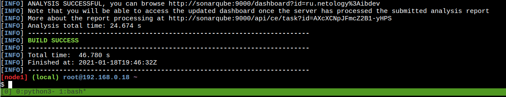

13\. Перейдите в Web-интерфейс SonarQube:

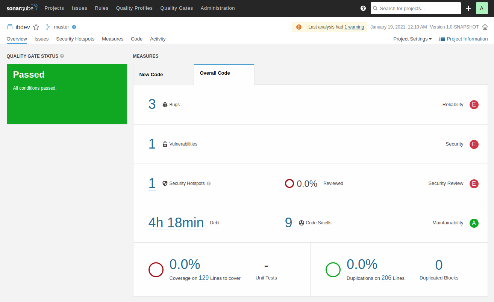

14\. Перейдите в раздел Bugs (ошибки в программном коде):

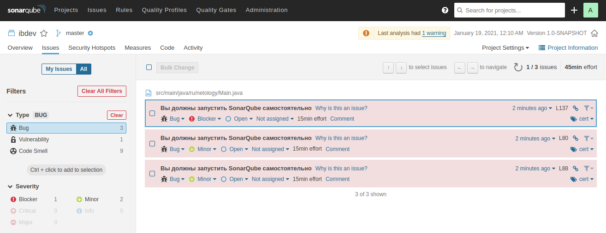

В этом разделе для каждой записи вы можете:
1. Изменить тип (Bug, Vulnerability, Code Smell)
1. Установить приоритет (Blocker - блокирует всю работу над продуктом, Critical - критичный, Major - важный, Minor - не важный, Info - информационное сообщение)
1. Статус (Open - открыт, Resolve as fixed - "закрыть" как исправлено, Resolve as false positive - "закрыть" как ложное срабатывание, Resolve as won't fix - "закрыть" как непланируемое к исправлению)
1. Увидеть примерную оценку по времени на исправление
1. Установить комментарий

15\. Перейдите в раздел Vulnerabilities (уязвимости в программном коде):

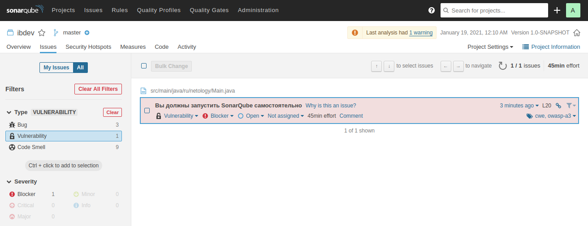

В этом разделе для каждой записи вы можете:
1. Изменить тип (Bug, Vulnerability, Code Smell)
1. Установить приоритет (Blocker - блокирует всю работу над продуктом, Critical - критичный, Major - важный, Minor - не важный, Info - информационное сообщение)
1. Статус (Open - открыт, Resolve as fixed - "закрыть" как исправлено, Resolve as false positive - "закрыть" как ложное срабатывание, Resolve as won't fix - "закрыть" как непланируемое к исправлению)
1. Увидеть примерную оценку по времени на исправление
1. Установить комментарий

16\. Перейдите в раздел Security Hotspots (код, требующий ручного анализа на предмет наличия уязвимости):

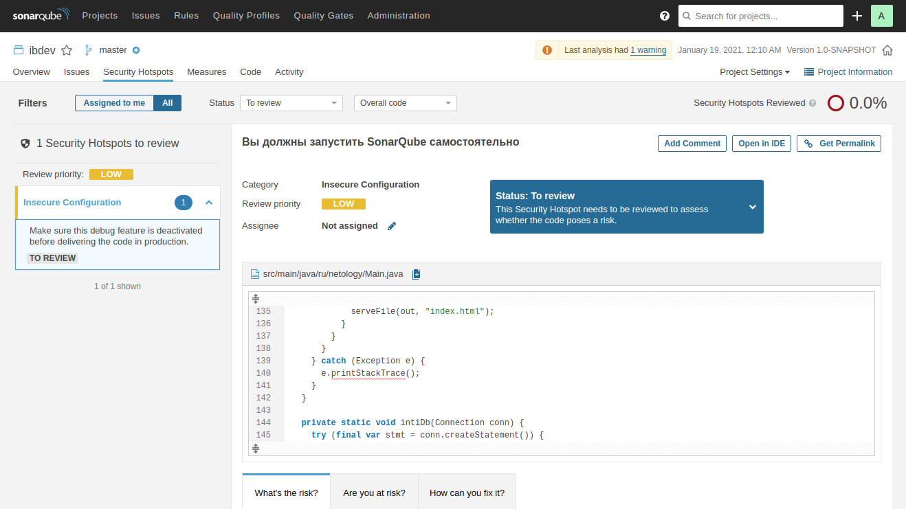

В этом разделе для каждой записи вы можете:
1. Выставить статус
1. Назначить ответственного

17\. Перейдите в раздел Code Smells (запахи кода - признаки плохого кода):

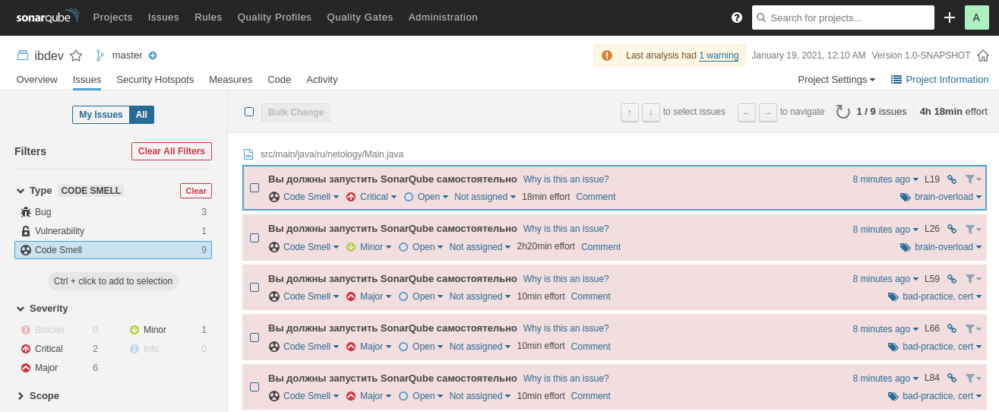

В этом разделе для каждой записи вы можете:
1. Изменить тип (Bug, Vulnerability, Code Smell)
1. Установить приоритет (Blocker - блокирует всю работу над продуктом, Critical - критичный, Major - важный, Minor - не важный, Info - информационное сообщение)
1. Статус (Open - открыт, Resolve as fixed - "закрыть" как исправлено, Resolve as false positive - "закрыть" как ложное срабатывание, Resolve as won't fix - "закрыть" как непланируемое к исправлению)
1. Увидеть примерную оценку по времени на исправление
1. Установить комментарий

### Результаты выполнения

Пришлите в личном кабинете студента ответы на следующие вопросы:
1. Какие баги были выявлены (количество, описание, почему SonarQube их считает багами, см. ссылку `Why is this an issue?`)
1. Какие уязвимости были выявлены (количество, категории, описание, почему SonarQube их считает уязвимостями)
1. Какие Security Hotspots были выявлены (количество, категории, приоритет, описание, почему SonarQube их считает Security HotSpot'ами)
1. К каким CWE идёт отсылка для Security Hotspots из п.2 (см. вкладку `How can you fix it?` в нижней части страницы)
1. Какие запахи кода были выявлены (количество, описание, почему SonarQube их считает запахами кода, см. ссылку `Why is this an issue?`)
