# Домашнее задание к занятию «3.1. DevSecOps и AppSec». Часть 1

Пришлите ответы на вопросы в личном кабинете студента на сайте [netology.ru](https://netology.ru).

## Описание

Домашнее задание — лабораторная работа, в рамках которой вы по инструкциям выполните действия.

## Задание GitLab

Это домашнее задание не обязательно, так как для него нужна регистрация на стороннем сервисе.

В этом задании применяется сервис GitLab — один из комплексных и самых популярных решений для поддержки DevOps и DevSecOps.

Вы будете использовать пробную версию из облака для упрощения настройки и развёртывания.

Командой GitLab уже подготовлены и настроены инструменты, которые позволяют выполнять действия.

1. Анализировать код на уязвимости — SAST, включая зависимости — SCA или Dependency Scanning.
2. Анализировать контейнеры на уязвимости — Container Scanning.
3. Анализировать используемые в проекте лицензии — License Scanning.
4. Проверять секреты — Secret Detection.

Список всех проверок доступен по адресам:
* https://gitlab.com/gitlab-org/gitlab/-/tree/master/lib/gitlab/ci/templates/Security
* https://docs.gitlab.com/ee/user/application_security/ (документация)

### Этапы выполнения

1\. Перейдите [по ссылке](https://gitlab.com/-/trial_registrations/new) и зарегистрируйте новую учётную запись.

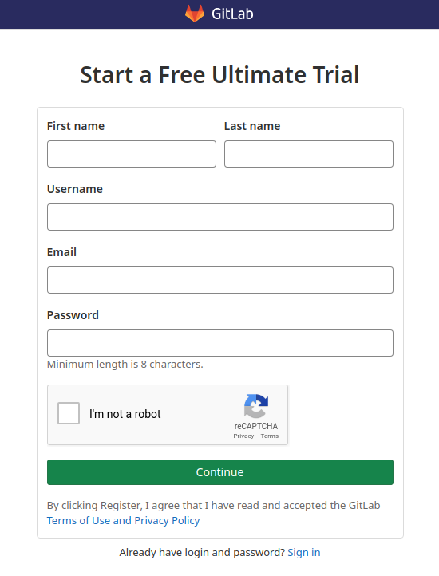

2\. Установите значения, как на скриншоте, и нажмите кнопку `Continue`.

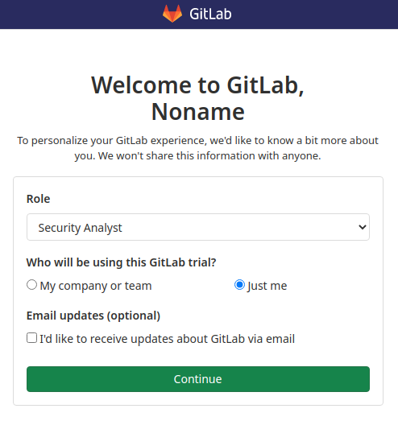

3\. Заполните данные для продолжения.

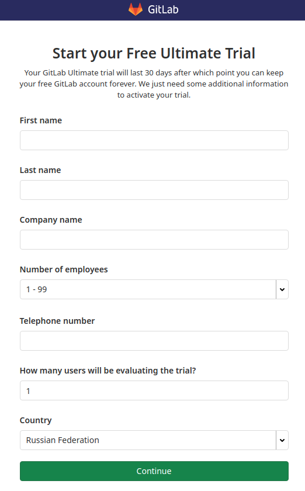

4\. Введите название для группы проектов.

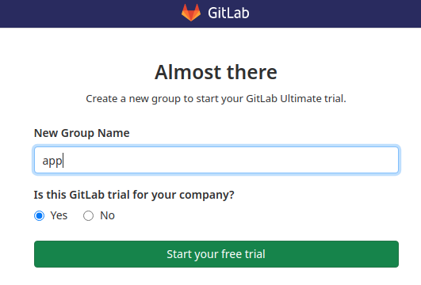

5\. Дождитесь перехода на главную страницу. 

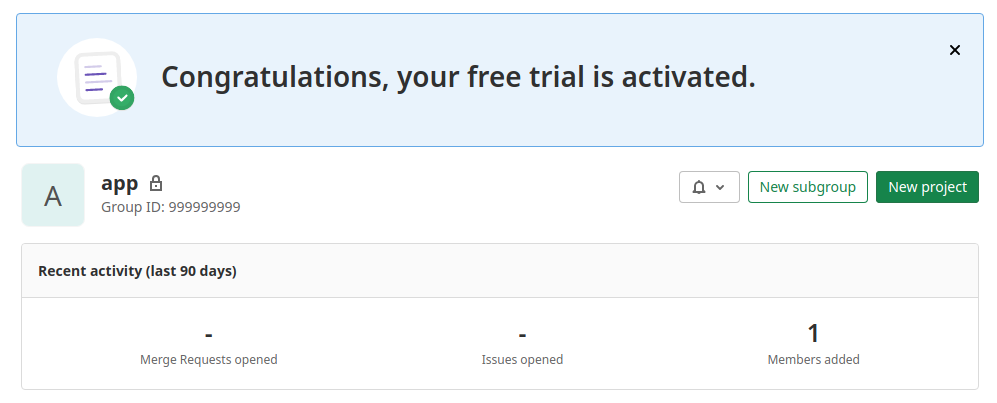

6\. Перейдите в свой email, указанный при регистрации, и подтвердите регистрацию.

7\. Нажмите на кнопку `New Project` для создания нового проекта.

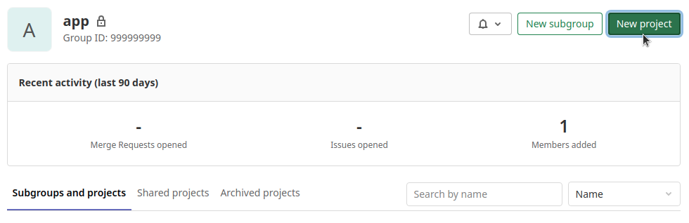

8\. Выберите `Import project` для импорта готового проекта.

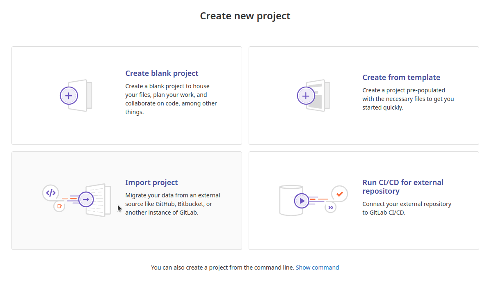

9\. Нажмите на кнопку `Repo By URL` и заполните поле Git repository URL ссылкой https://github.com/netology-code/ib-devsecops-app.git.

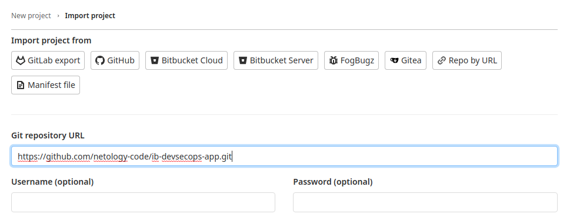

10\. Оставьте остальные поля заполненными по умолчанию и нажмите `Create project`.

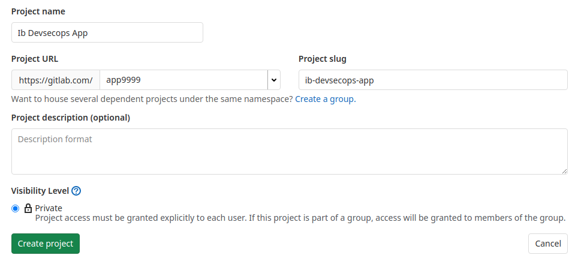

11\. Зайдите в пункт меню `CI/CD` — `Pipelines` и нажмите на кнопку `Run Pipeline`.

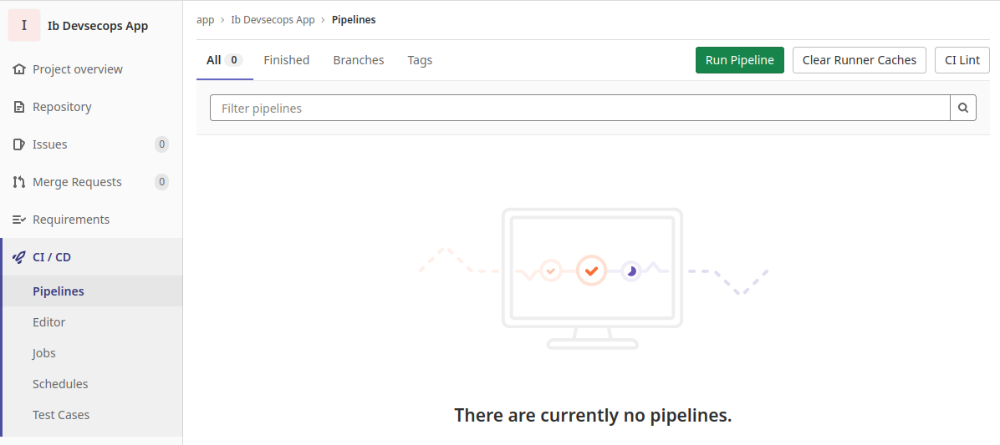

12\. На странице снова нажмите на кнопку `Run Pipeline`.

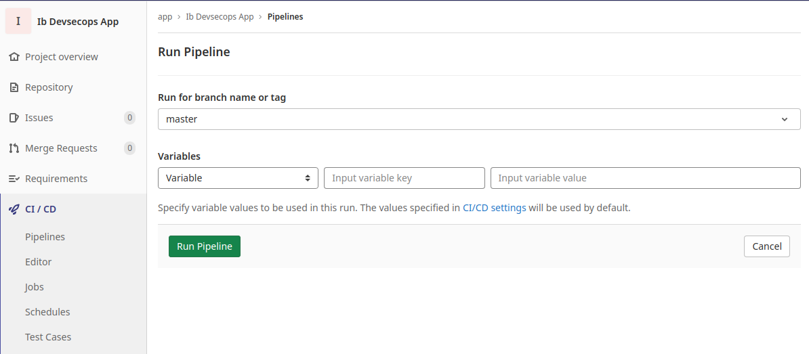

13\. Дождитесь окончания процесса анализа.

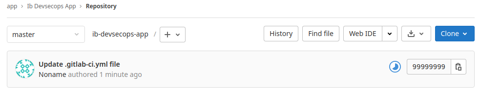

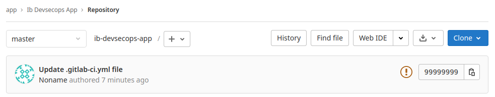

**Примечание**. В списке задач вы увидите упавшую задачу с `retire-js`. Это нормально.

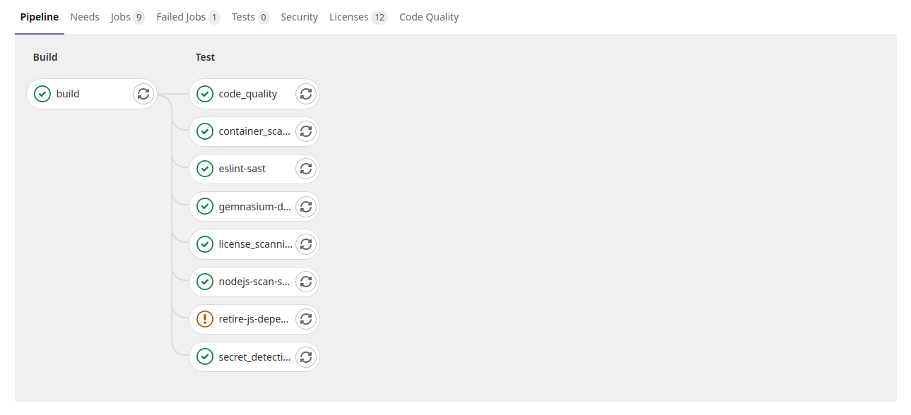

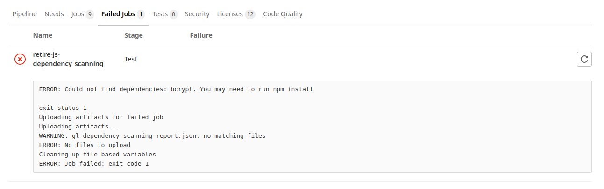

14\. Перейдите в раздел `Security & Compliance`.

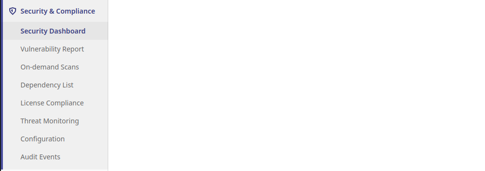

15\. Изучите внимательно разделы:

- Vulnerability Report (отчёт об уязвимостях);
- Dependency List;
- License Compliance.

### Ответьте на вопросы:

**Важно**: после окончания проверки подождите пару минут и несколько раз обновите страницу через `Shift` + `F5`. Иногда не все данные по проверкам подтягиваются сразу. Убедитесь, что уязвимости точно найдены для приложения, зависимостей и контейнера.

1\. Сколько уязвимостей и какого уровня значимости найдено (Severity)?

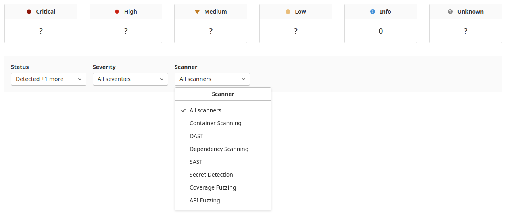

2\. Сколько из них:

- в самом приложении (SAST);
- в контейнерах (Container Scanning);
- в зависимостях (Dependency Scanning);
- секретов (Secret Detection).

3\. Какая уязвимость найдена в самом приложении?

4\. Сколько зависимостей в приложении?

5\. Сколько различного рода лицензий используется в приложении и его зависимостях?

### Решение задания

Пришлите в личном кабинете студента ответы на вопросы из раздела «Ответьте на следующие вопросы» и скриншот статистики со всеми найденными уязвимостями. Нужны только числа в секциях `Critical`, `High`, `Medium`, `Low`.

Не удаляйте свою учётную запись после завершения работы. Она вам понадобится на следующей лекции.

